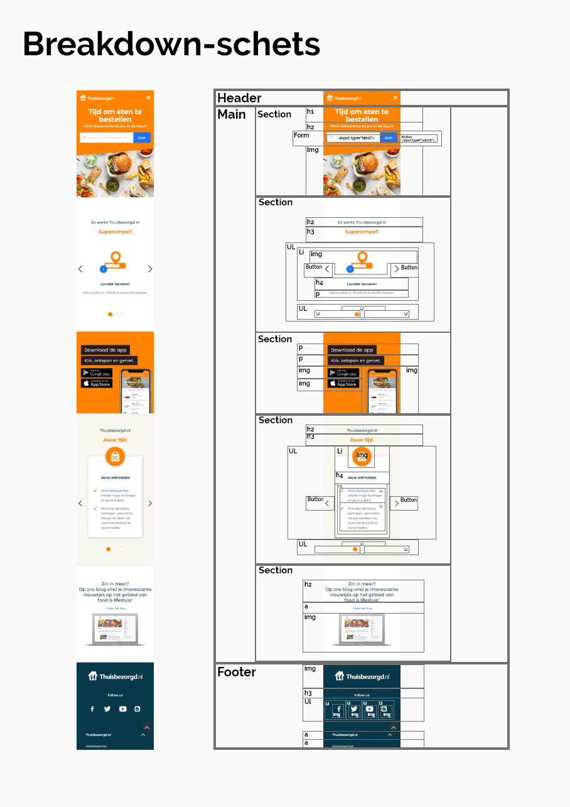
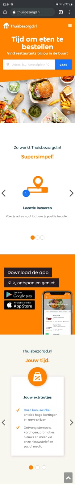
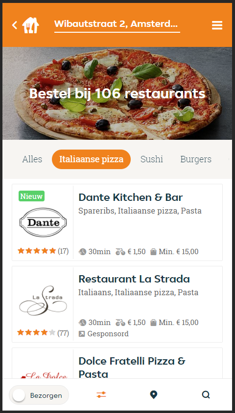

# Procesverslag

https://jessesilva1999.github.io/JesseSilva.FED/

**Auteur:** -Jesse Silva-

## Bronnenlijst
1. https://stackoverflow.com/questions/17704539/css-getting-text-in-one-line-rather-than-two
2. https://www.w3schools.com/cssref/tryit.asp?filename=trycss_display
3. https://www.dailysmarty.com/posts/how-to-darken-an-image-with-css
4. https://stackoverflow.com/questions/4622808/html-changing-colors-of-specific-words-in-a-string-of-text
5. https://www.w3schools.com/howto/tryit.asp?filename=tryhow_js_read_more

## Eindgesprek (week 7/8)

AVV
-Toegankelijkheid, linkjes toevoegen naar andere pagina's
-Geen inline CSS/javascript
-Java op manier CODEPEN #robert

Matig
-opzet restaurantlijst
-mapindeling
-geen ophoging
-bepaalde namen classes

## Voortgang 3 (week 6)

Class names minder & beter verwoorden
geen pixels, em gebruiken

1e pagina
-Footer moet bestaan uit losse icoontjes
-Geen plaatje bij "jouw extraatjes"

2e pagina
-javascript gebruiken voor restaurants
-Menu netter maken (SS)

## Voortgang 2 (week 5)

1e pagina
-width: 100%; toepassen
-p in de footer
-overlay is als enige absolute

2e pagina
-menu's bestaat uit UL's met een active UL
-section > article > img + p + 3x span gebruiken (zoals aantekeningen)
-Static menu in de footer

## Voortgang 1 (week 3)

-Overbodige ID tags weghalen
-sections netter ordenen
-uitleg toevoegen
-photos opslaan
-CSS -1index gebruiken om schuine rand te creeren

## Breakdownschets (week 1)

## Intake (week 1)
-uitwerken voor de kick-off werkgroep - begin van de eerste week-

**Je startniveau:** -blauw-

**Je focus:** -surface plane-

**Je opdracht:** -www.thuisbezorgd.nl-

**Screenshot(s) van de pagina (small screen):**

